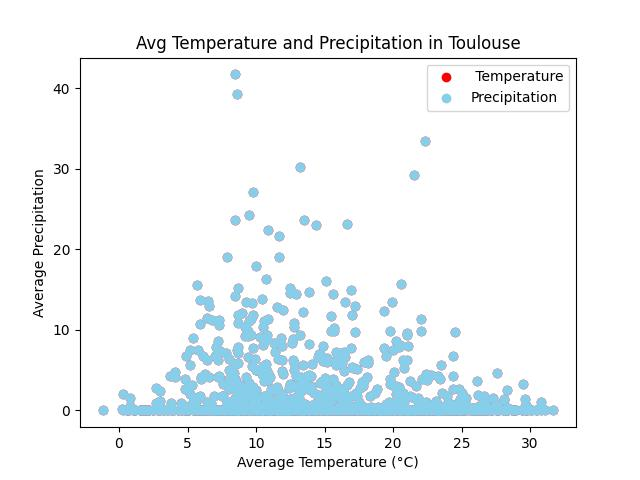

# Author: Rodiyah Oluwa
# Student ID: D3127027
# Project Name: Phase 2

Building on the groundwork laid in Phase 1, Phase 2 of the project introduces a number of charts and visualizations to offer more in-depth understanding of the underlying data. By highlighting significant links, trends, and patterns found in the dataset, these charts hope to improve readers' comprehension of the project's goals as a whole.

## Charts

### Chart 1: Average Mean Temperature by City

This chart gives a thorough summary of the average mean temperature in several cities for a chosen time period. The purpose of the chart is to shed light on the patterns and changes in the climate that various geographic areas have seen throughout the given period of time.

Data Source: Using Python in Visual Studio Code(VSC), the data for this graphic was taken from a SQL database . The SQL database includes weather data from 2020 to 2022 for a number of different countries and cities.

### Chart 2: Average Annual Precipitation by Countries

The average yearly precipitation amounts in several countries are shown in this visualization. The map makes it easier to identify areas with higher or lower rates of precipitation by illuminating how rainfall and other types of precipitation are distributed across each nation.

Data Source: Using Python in Visual Studio Code(VSC), the data for this graphic was taken from a SQL database . The SQL database includes weather data from 2020 to 2022 for a number of different countries and cities.

### Chart 3: Minimum and Maximum Temperature For a 10 day period Multi Line Chart

The daily minimum and maximum temperatures are shown on this multi-line chart for a span of ten days, giving an overview of the temperature range during that time.

Data Source: Using Python in Visual Studio Code(VSC), the data for this graphic was taken from a SQL database . The SQL database includes weather data from 2020 to 2022 for a number of different countries and cities.

### Chart 4: Average Annual Temperature by City

The average yearly temperature for a range of cities is displayed in this visualization. The graph offers an analysis of average temperatures per city for the chosen period of time, providing insights into regional climatic variations.

Data Source: Using Python in Visual Studio Code(VSC), the data for this graphic was taken from a SQL database . The SQL database includes weather data from 2020 to 2022 for a number of different countries and cities.

### Chart 5: Climate Scatter Graph

The association between the average temperature and precipitation for a particular city is shown graphically in this scatter graph. The chart presents an overview of the temperature and precipitation trends of the city by showing individual data points for each month or season.

Data Source: Using Python in Visual Studio Code(VSC), the data for this graphic was taken from a SQL database . The SQL database includes weather data from 2020 to 2022 for a number of different countries and cities.

## How to Run The Program

### Installation
To run this program, follow the steps below:
1. **Install Application**
Make sure the following applicaions are installed on your system:
**Python:** Python is used to write this project. It is available for download at python.org.
**Visual Studio Code(VSC):** Visual Studio Code is suggested if you wish to use an integrated development environment (IDE). It is available for download at code.visualstudio.com.

2. **Install Dependencies**
Use the following command to install the necessary dependencies:
    pip install -r phase_2.txt

### Running the Program
After the installation is complete, you can run the main script to open the application. Navigate to the main script (phase_2.py) in the integrated terminal after opening the project folder in Visual Studio Code, and then run the following command:
python phase_2.py
 

